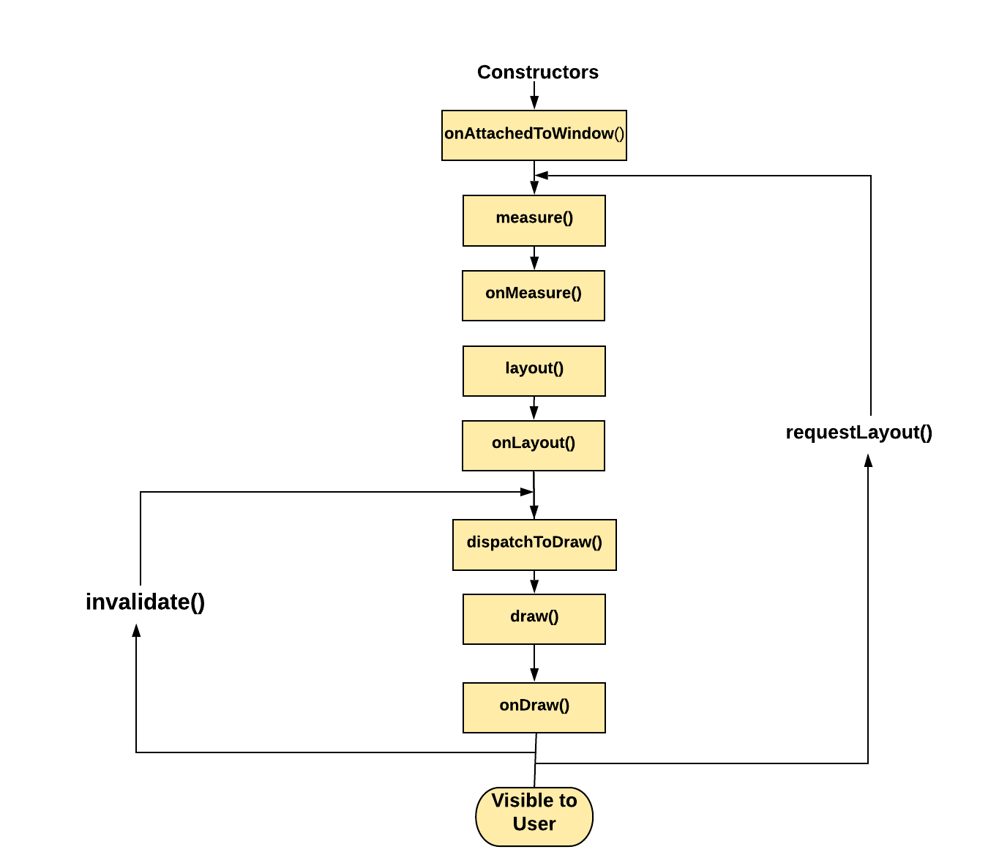

# Android Interview

## Android UI Design Questions

1. #### How we can present different styles/drawables for a button depending on the state of the button (pressed, selected, etc.) using XML?

2. #### What is the difference between `View.GONE` and `View.INVISIBLE`?

3. #### Have you used Canvas in UI?

4. #### What is a 9patch image? does it tile or stretch?
   * 9 Patch images are stretchable, repeatable images reduced to their smallest size

5. #### What is the difference between `View` and `ViewGroup`?

   - `View` : Just a Single view like ImageView Or TextView
   - `ViewGroup` : It’s a container which contains multiple view like LinearLayout, RelativeLayout

6. #### How to create Custom Views and what are the lifecycle methods?

   - Custom view is something which you design your own way, Like for login you want to use a particular type of edit text , which you are using at multiple places. You can create a custom view for that and use it in multiple xml files.
   - View Lifecycle
   

7. #### What is Android Jetpack Compose, and why was it introduced?

   - Android Jetpack Compose is a modern UI toolkit introduced by Google for building native Android applications. It was introduced to simplify and enhance the UI development process by providing a declarative and reactive approach to building UIs.

8. #### Explain the difference between View-based UI framework and Jetpack Compose.

   - The View-based UI framework uses XML layout files and imperative code to create and manage UI components. Jetpack Compose, on the other hand, uses a declarative approach where UI components are described as functions of the application state. Compose simplifies UI development, reduces boilerplate code, and provides a more intuitive way to create interactive UIs.

9. #### What are the advantages of using Jetpack Compose over the traditional View system?

   - **Declarative UI**: Compose allows developers to describe the UI based on the current state, making the code more concise and readable.
   - **Live Previews:** Compose offers real-time UI previews in Android Studio, enabling instant visual feedback during development.
   - **Simplified State Management:** Compose simplifies state management by automatically recomposing only the affected parts of the UI when the state changes.
   - **Enhanced Performance:** Compose leverages efficient rendering and diffing algorithms, resulting in improved performance compared to the traditional View system.

10. #### What is a Composable function in Jetpack Compose?

   - A Composable function is a regular Kotlin function annotated with the `@Composable` annotation. It is the fundamental building block in Jetpack Compose and describes a UI component's appearance and behavior. Composable functions are independent of the activity or fragment lifecycle, making them reusable and testable.

11. #### How does state management work in Jetpack Compose?

   - State management in Jetpack Compose revolves around the concept of mutable state. Compose provides the `mutableStateOf` function to create observable state objects. When the state changes, Jetpack Compose automatically recomposes only the affected parts of the UI, ensuring efficient UI updates.

12. #### What is the role of the Modifier in Jetpack Compose?

- The Modifier is used to customize and apply transformations to UI elements in Jetpack Compose. It allows you to specify properties such as size, padding, alignment, background color, and more. Modifiers can be chained together to apply multiple transformations to a single UI element.

13. #### How is navigation handled in Jetpack Compose?

- Navigation in Jetpack Compose is handled using the Navigation Compose library. It introduces the concept of navigation graphs, where each screen or destination is represented by a composable function. The navigation graph defines the connections between destinations, and navigation actions can be triggered using predefined navigation methods.

14. #### Explain the concept of recomposition in Jetpack Compose.

- Recomposition is the process of automatically updating only the parts of the UI that have changed when the state variables of a Composable function are modified. Jetpack Compose tracks the dependencies between Composable functions and their state variables. When a state variable changes, only the affected Composable functions are recomposed, ensuring efficient UI updates.

15. #### How can you handle user input and events in Jetpack Compose?

- User input and events can be handled using event callbacks and state variables in Jetpack Compose. Composable functions can define event callbacks that are triggered when a user interacts with the UI. These callbacks can modify the state variables, leading to UI recomposition and updates.

16. #### What is the purpose of ViewModel in Jetpack Compose?

- ViewModel in Jetpack Compose is used for managing and preserving UI-related data across configuration changes. It provides a way to separate the UI logic from the UI components and allows sharing data between multiple Composable functions. ViewModels can be accessed using the `viewModel` or `viewModel<>()` functions.

17. #### How does Jetpack Compose integrate with existing Android frameworks and libraries?

- Jetpack Compose can be integrated with existing Android frameworks and libraries by using interoperability features. Compose provides compatibility libraries to bridge the gap between Compose and existing View-based UI components. Additionally, Compose supports the embedding of traditional View-based components within Composable functions using the `AndroidView` or `ComposeView` APIs.

18. #### What are the key components of the Jetpack Compose architecture?

- The key components of the Jetpack Compose architecture include Composable functions, state management, the Modifier system, navigation with the Navigation Compose library, ViewModel, and integration with existing Android frameworks.

19. #### How do you perform animations in Jetpack Compose?

- Animations in Jetpack Compose can be performed using the `animate*` family of functions. These functions allow you to animate changes to UI properties, such as size, position, opacity, and color. Jetpack Compose handles the animation updates and UI recomposition automatically.

20. #### What is the purpose of ConstraintLayout in Jetpack Compose?

- ConstraintLayout in Jetpack Compose is used to create complex and responsive layouts. It allows you to define constraints between UI elements, enabling flexible positioning and resizing based on the available space. ConstraintLayout helps in building dynamic and adaptive UIs.

21. #### How do you handle theming and styling in Jetpack Compose?

- Theming and styling in Jetpack Compose are handled using the `MaterialTheme` and `@Composable` functions. MaterialTheme provides a pre-defined set of styles and attributes, while the `@Composable` function allows for creating custom styles and applying them to UI elements.

22. #### Explain the concept of side effects in Jetpack Compose.

- Side effects in Jetpack Compose refer to operations that have additional effects beyond modifying the UI state. Examples include making network requests, accessing databases, or updating shared preferences. Side effects are handled using functions like `LaunchedEffect` or `DisposableEffect`, which allow you to perform these operations while ensuring proper lifecycle management.

23. #### How can you handle asynchronous operations in Jetpack Compose?

- Asynchronous operations in Jetpack Compose can be handled using Kotlin coroutines and the suspend function modifier. You can launch coroutines within Composable functions using `LaunchedEffect` or other coroutine builders. This allows you to perform asynchronous operations off the main thread and update the UI when the operation completes.

24. #### What are Compose key events, and how are they used?

- Compose key events allow you to handle keyboard events, such as key presses, in Jetpack Compose. You can use the `onKeyEvent` modifier to listen to key events and define the corresponding actions within Composable functions.

25. #### How do you test UI components in Jetpack Compose?

- Jetpack Compose provides a testing framework that allows you to write tests for UI components. You can use the `@Composable` test rule and the `composeTestRule` to interact with and assert the behavior of Composable functions and UI elements.

26. #### What is the purpose of remember in Jetpack Compose, and how is it used?

- The `remember` function in Jetpack Compose is used to create and store a value that survives recomposition. It allows you to preserve and reuse expensive computations or expensive objects, optimizing performance by avoiding unnecessary recomputations.

27. #### What is the role of StateFlow and SharedFlow in Jetpack Compose?

- StateFlow and SharedFlow are part of the Kotlin coroutines library and can be used in Jetpack Compose for managing state and asynchronous data streams. StateFlow represents a state value that can be observed for changes, while SharedFlow represents a hot data stream that can be collected by multiple collectors.

28. #### How can you handle input validation in Jetpack Compose?

- Input validation in Jetpack Compose can be handled by combining state management and event callbacks. You can use state variables to hold the input values and define validation logic within event callbacks or helper functions. Based on the validation results, you can update the UI to provide feedback to the user.

29. #### Explain the concept of lazy composition in Jetpack Compose.

- Lazy composition in Jetpack Compose allows you to defer the execution of expensive Composable functions until they are actually needed. It helps optimize performance by only recomposing and rendering UI components when they become visible or relevant to the current state.

30. #### What are recomposition triggers, and how can you use them?

- Recomposition triggers are used to manually trigger recomposition of specific parts of the UI. They allow you to control the timing of UI updates and ensure that only the necessary parts are recomposed. Recomposition triggers can be used in scenarios where you want to force an update, such as handling external events or user interactions.

31. #### How can you handle keyboard input in Jetpack Compose?

- Keyboard input in Jetpack Compose can be handled using the `TextField` component. It provides an editable text field that allows users to enter text and handles keyboard events, such as input changes or key presses. You can customize the behavior of the `TextField` using various parameters and modifiers.

32. #### What is the role of CompositionLocal in Jetpack Compose?

- CompositionLocal in Jetpack Compose is used to provide values that can be accessed by the Composable functions in the composition tree. It allows you to pass down values, such as themes, fonts, or other contextual information, without explicitly passing them through function parameters.

33. #### How do you handle orientation changes in Jetpack Compose?

- Orientation changes in Jetpack Compose are handled automatically by recomposing the UI based on the new configuration. Composable functions that define the UI layout and behavior will be recomposed with the updated configuration, allowing the UI to adapt to the new orientation.

34. #### Explain the concept of accessibility support in Jetpack Compose.

- Accessibility support in Jetpack Compose allows you to create UIs that are accessible to users with disabilities. Compose provides accessibility modifiers, such as `semantics`, `screenReaderOnly`, and `clickable`, to enhance the accessibility of UI elements. You can also use `setContentDescription` to provide meaningful descriptions for screen readers.

35. #### How can you integrate Jetpack Compose with data binding?

- Jetpack Compose can be integrated with data binding by using the `observeAsState` function. It allows you to observe LiveData objects from the data binding library and use them as state variables within Composable functions. This enables seamless integration between Compose and data binding in mixed projects.

36. #### What are the best practices for performance optimization in Jetpack Compose?

- Some best practices for performance optimization in Jetpack Compose include:
- Minimize unnecessary recompositions by using immutable state objects and avoiding excessive state changes.
- Use the `remember` function to cache expensive computations and avoid unnecessary recomputations.
- Use the `key` parameter to explicitly control the identity of Composable functions and optimize the diffing algorithm.
- Use `LaunchedEffect` and other coroutine-based APIs to perform asynchronous operations off the main thread and ensure smooth and responsive user interfaces in Jetpack Compose.