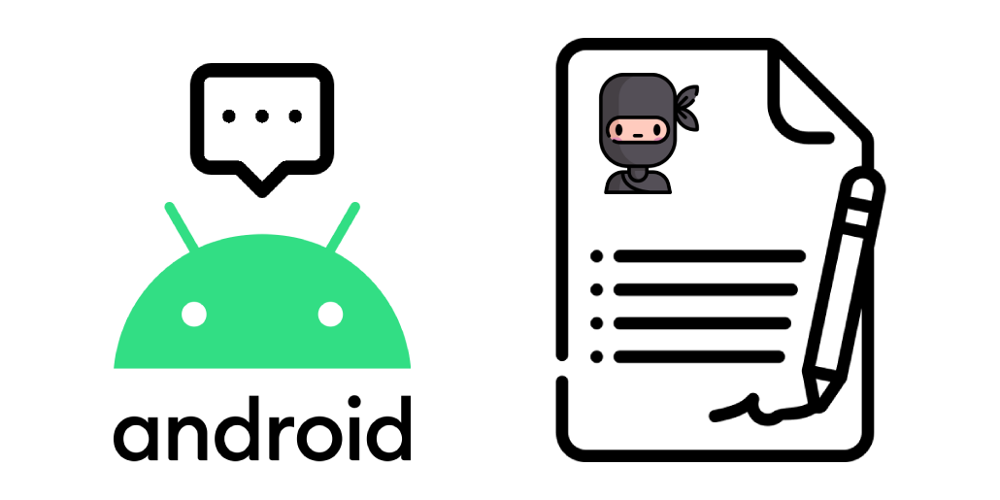

# Android Interview Questions


This repository holds technical interview questions for the Senior Android Developer position which has been was asked from me or I usually ask from other candidates. Feel free to contribute and improve it.

## Table of contents
* [General questions](#general-questions)
* [Object Oriented Programming](#object-oriented-programming)
* [Java Programming](#java-programming)
* [Android Foundation](#android-foundation)
* [Android UI Design](#android-ui-design)
* [Software Architecture Design](#software-architecture-design)
* [Testing](#testing)
* [License](#license)

## General questions
1. #### What were your last 3 applications? which was the best? and why?
2. #### What was the most challenging thing you have done in an application?
3. #### Which websites and blogs you use as Android references?
   * [developer.android](https://developer.android.com/)
   * [StackOverflow](https://stackoverflow.com/questions/tagged/android)
   * [Medium.com](https://medium.com/)
   * [Android weekly newsletter](https://androidweekly.net/)
   * [Kotlin weekly newsletter](http://www.kotlinweekly.net/)
   * [Caster.io](https://caster.io/)
   * [Droidcon.com](https://www.droidcon.com/)
   * [KotlinConf.com](https://kotlinconf.com/)
4. #### Why do you consider yourself a Senior Developer? Who is a senior developer? What is the definition of being a Senior Developer?
   * Being senior is mostly about sharing, your knowledge, experience, time, ...
5. #### Do you do any Documentations?
6. #### What is your most proud Android development?
7. #### What’s your weakness and power in Android development?
8. #### What project management tools have you used before?
   * Jira
   * asana
   * Trello
9. #### Are you familiar with Agile, SCRUM, Sprint, , ...?
10. #### What are the aspects of your job that you really enjoy?
11. #### What is GitFlow? do you follow it?
12. #### Describe Test-Driven Development (TDD).

## Object Oriented Programming
1. #### Name some of the characteristics of OOP languages
   * Abstraction
   * Encapsulation
   * Inheritance
   * Polymorphism
2. #### What are the access modifiers you know? What does each one do?
   * `public`: modifier is widely-used on classes, variables, constructors and methods to grant access from any class and method anywhere.
   * `private` (by default) : variables, methods, constructors or inner classes are only visible to its' containing class and its' methods.
   * `protected`: can be used on variables, methods and constructors therefore allowing access only to subclasses and classes that are inside the same package as protected members' class.
3. #### What is the difference between overriding and overloading a method in Java?
   * Overload (one method with different signature)
   * @Override
4. #### Can an Interface extend another Interface?
   * An interface can extends multiple interfaces.
   * A single class can also implement multiple interface.
5. #### What does the static word mean in Java?
   * static members belong to the class instead of a specific instance.
6. #### Can a static method be overridden in Java?
   * Static methods cannot be overridden because they are not dispatched on the object instance at runtime.
7. #### Can a constructor be inherited?
   * Constructors are not members of classes and only members are inherited.
8. #### Which Design Patterns you are familiar with?
   * Creational patterns
      * Builder
      * Factory
      * Singleton
      * Monostate
      * Fluent Interface Pattern
   * Structural patterns
      * Adapter
      * Decorator
      * Facade
   * Behavioural patterns
      * Chain of responsibility
      * Iterator
      * Strategy
9. #### Which design patterns are used in Android?
   * `View Holder` uses Singleton
   * `Intent` uses Factory
   * `Broadcast Receiver` uses Observer
   * `View` uses Composite
   * Media FrameWork uses Façade
   * `Toast.makeText()` uses Factory
10. #### What is the difference between Composition and Inheritance? How we should decide which one to use?
   * Using **is** vs **has** rule (Cat is an Animal / Person has a Job)
11. #### Do you know SOLID (object-oriented design)?
   * **S**ingle responsibility principle:
      * A class should have only a single responsibility (i.e. only one potential change in the software’s specification should be able to affect the specification of the class
      * a class should have only one single responsibility
      * One chef cannot run the whole restaurant
   * **O**pen/closed principle:
      * A software module/class/method should be open for extension but closed for modification.
      * any software entity should be open for extension but closed for modification.
      * Trying new shoes doesn’t require you to saw your feet off.
   * **L**iskov substitution principle:
      * Objects in a program should be replaceable with instances of their subtypes without altering the correctness of that program
   * **I**nterface segregation principle:
      * Clients should not be forced to depend upon the interfaces that they do not use.
      * many client-specific interfaces are better than one general-purpose interface.
   * **D**ependency inversion principle:
      * Program to an interface, not to an implementation.
      * The high-level module must not depend on the low-level module, but they should depend on abstractions. one should “Depend upon Abstractions. Do not depend upon concretions.
      * You wouldn’t wire a lamp directly to your house.
12. #### Why we use the builder design pattern? How Kotlin improves this use case?
   * to avoid multiple implementations of the constructor for setting different fields in a class.
13. #### What is the difference between Abstract Class and Interface?
14. #### What are the types of GoF ([Gang of Four](https://en.wikipedia.org/wiki/Design_Patterns)) design patterns? Provide examples.
   * Creational
   * Structural
   * Behavioral.

## Java Programming
1. #### What are the differences between a `SparseArray` and `Hashmap`?
   * Sparse arrays can be used to replace hash maps when the key is an Integer or a Long (HashMap <Integer, V>).
   * is made to be memory efficient than using the regular HashMap
   * It is generally slower than a traditional HashMap
   
2. #### What are the differences between a `LinkedList` vs `ArrayList`?
   * two different implementations of the List interface
   * LinkedList implements it with a doubly-linked list.
   * ArrayList implements it with a dynamically re-sizing array.
   * LinkedList is better for working with stacks mostly, or when working with buffers.
   * ArrayList is best for working with indexes.
   
3. #### What is the difference between HashSet, HashMap and Hashtable? How do they behave in a multi-threaded environment?
   
   - ##### Hashtable
   
      Hashtable is basically a data structure to retain values of key-value pair.
   
      - It does not allow null for both key and value. It will throw NullPointerException.
      - Hashtable does not maintain insertion order. The order is defined by the Hash function. So only use this if you do not need data in order.
      - It is synchronized. It is slow. Only one thread can access in one time.
      - HashTable rea thread safe.
      - HashTable uses Enumerator to iterate through elements.
   
      ```java
      Hashtable<Integer,String>; myTable = new Hashtable<Integer,String>();
      
      myTable.put(1, "John");
      myTable.put(2, "Cena");
      myTable.put(3, null); /* NullPointerEcxeption at runtime*/
      
      System.out.println(myTable.get(1));
      System.out.println(myTable.get(2));
      System.out.println(myTable.get(3));
      ```
   
   - ##### HashMap
   
     Like Hashtable it also accepts key value pair.
   
     - It allows null for both key and value.
     - HashMap does not maintain insertion order. The order is defined by the Hash function.
     - It is not synchronized. It will have better performance.
     - HashMap are not thread safe, but you can use Collections.synchronizedMap(new HashMap<K,V>())
   
     ```java
     HashMap<Integer,String> myMap = new HashMap<Integer,String>();
     
     myMap.put(1, "First");
     myMap.put(2,"Second");
     myMap.put(3, null);
     ```
   
   - ##### HashSet
   
     HashSet does not allow duplicate values.
   
     - It provides add method rather put method.
     - You also use its contain method to check whether the object is already available in HashSet. HashSet can be used where you want to maintain a unique list.
   
     ```java
     HashSet<String> mySet = new HashSet<String>();
     
     mySet.add ("First");
     mySet.add ("Second");
     mySet.add ("Third");
     
     if(mySet.contains("First")){
     	System.out.println("The Set already contains First");
     }
     ```
   
4. #### What is a Deadlock In java?

   * Deadlock describes a situation where two or more threads are blocked forever, waiting for each other.

5. #### How we can avoid Deadlocks?
   * Breaking circular wait condition: In order to do that, you can make arrangements in the code to impose the ordering on acquisition and release of locks.
   * Avoid Nested Locks: This is the most common reason for deadlocks, avoid locking another resource if you already hold one. It’s almost impossible to get a deadlock situation if you are working with only one object lock.
   * Lock Only What is Required: You should acquire lock only on the resources you have to work on, if we are only interested in one of its fields, then we should lock only that specific field, not complete object.
   * Avoid waiting indefinitely: You can get a deadlock if two threads are waiting for each other to finish indefinitely using thread join. If your thread has to wait for another thread to finish, it’s always best to use join with the maximum time you want to wait for the thread to finish.

6. #### What is the difference between a process and a thread in Java/Android?
   * A program in execution is often referred to as Process. A thread is a part of the process.
   * A process consists of multiple threads. A thread is the smallest part of the process that can execute concurrently with other threads of the process.
   * A process is sometimes referred to as “Task”. A thread is often referred to as a “Lightweight” process.
   * A process has its own address space. A thread uses the process’s address space and shares it with the other threads of that process.
   * A thread can communicate with other threads (of the same process) directly by using methods like wait(), notify(), notifyAll(). A process can communicate with another process by using inter-process communication (IPC/AIDL).
   * New threads are easily created. However, the creation of new processes requires duplication of the parent process.
   * Threads have control over the other threads of the same process. A process does not have control over the sibling process, it has control over its child processes only.

7. #### What’s new in the Android 10 (Q) version?
   * Foldables screens
   * 5G networks
   * Smart Reply in notifications
   * Dark Theme
   * Gesture navigation
   * Settings Panels
   * Sharing shortcuts
   * Privacy for users -> more control over location permission
   * Security
   * Camera and media -> Dynamic depth for photos
   * Connectivity
   * ART optimizations

8. #### How do you manipulate strings in Java without creating String garbage?
   * Using StringBuilder and StringBuffer/StringBuilder

9. #### What is the basic difference between String and StringBuffer?
   * The string is an immutable object. StringBuffer is a mutable object.
   * StringBuffer is synchronized whereas StringBuilder is not synchronized.

10. #### What is a generic in java?
   * Stronger type checks at compile time. A Java compiler applies strong type checking to generic code and issues errors if the code violates type safety.

11. #### Why should the equals() and hashCode() methods often be overridden together?

12. #### In Java, does the finally block gets executed if we insert a return statement inside the try block of a try-catch-finally?
   * Yes!
12. #### Explain method overloading & overriding.
13. #### What is Java's Garbage Collection and how does it help you as a developer? Can two objects be garbage collected if they reference to each other?
   *  Cyclic dependencies without any live external reference are also eligible for GC.
14. #### Why are Array and ArrayList different? When would you use each?
   * Resizable: Array is static in size that is fixed length data structure, One can not change the length after creating the Array object. ArrayList is dynamic in size.
   * Multi-dimensional: Array can be multi dimensional , while ArrayList is always single dimensional.
   * Primitives:  ArrayList can not contains primitive data types (like int , float , double) it can only contains Object while Array can contain both primitive data types as well as objects.
15. #### What is a `ThreadPool`? Is it better than using several "simple" `Thread`s?
   * ThreadPool: represents a group of worker threads that are waiting for the job and reuse many times.
   * Using ThreadPool minimizes the overhead due to thread creation. Thread objects use a significant amount of memory, and in a large-scale application, allocating and deallocating many thread objects creates a significant memory management overhead.
16. #### What are strong, soft and weak references in Java?
   * Strong Reference: is the default Reference Object of a type/class
   * Weak Reference: When an object in memory is reachable only by Weak Reference Objects, it becomes automatically eligible for GC.
   * Soft Reference: Object is basically a weak Reference Object that remains in memory a bit more: normally, it resists GC cycle until memory is available and there is no risk of OutOfMemoryError
17. #### What does the keyword synchronized mean?
   * synchronized: is one of the tools that make your code thread safe.
   * synchronized methods can't be called in the same time from multiple threads.
18. #### What are `transient` and `volatile` modifiers?
   * transient: modifier tells the Java object serialization subsystem to exclude the field when serializing an instance of the class
   * volatile: modifier tells the JVM that writes to the field should always be synchronously flushed to memory, and that reads of the field should always read from memory.
19. #### How to implement thread safe counter.
   * Use AtomicInteger.
20. #### What are the states of Thread in Java?
   * New, Runnable, Blocked, Waiting, TimedWaiting, Terminated.
21. #### How to make object thread safe without synchronisation?
   * Make it immutable.
22. #### Explain how wait/notify mechanism works.
23. #### Describe implementation of HashMap. What is collision? Difference between HashSet and TreeSet?
24. #### Whether static method can use nonstatic members?
- NO
25. #### Do objects get passed by reference or value in Java?
   * In Java all primitives and objects are passed by value, meaning that their copy will be manipulated in the receiving method. But there is a caveat - when you pass an object reference into a method, a copy of this reference is made, so it still points to the same object! This means, that any changes that you make inside this object are retained, when the method exits.
26. #### What is the difference between instantiation and initialization of an object?
   * Initialization: is the process of the memory allocation, when a new variable is created.
   * Instantiation: is the process of explicitly assigning definitive value to a declared variable.
27. #### What is GC (garbage collector)? How does it work?
   * All objects are allocated on the heap area managed by the JVM. As long as an object is being referenced, the JVM considers it alive. Once an object is no longer referenced and therefore is not reachable by the application code, the garbage collector removes it and reclaims the unused memory.
28. #### What is volatile modifier?
   * The Java volatile keyword is used to mark a Java variable as "being stored in main memory", and not from the CPU cache.
29. #### What is `transient` modifier?
   * keyword is used in serialization. If you define any data member as transient, it will not be serialized.

## Kotlin programming
1. #### Have you tried Kotlin?
2. #### What are Coroutines in Kotlin?
3. #### What is Sealed Class in Kotlin?
   * power enum

## Android Foundation
1. #### What is ADB (Android Debug Bridge)?
2. #### What is ANR (Application not responding)?
3. #### What’s Android Runtime (ART) and Dalvik?
   * Android runtime (ART) is the managed runtime used by applications and some system services on Android.
   * Dalvik is the predecessor of ART
   * ART as the runtime executes the Dalvik Executable format and Dex bytecode specification.
4. #### What is the difference between `intent` , `sticky intent` , and `pending intent`?
   * intent: is a message-passing mechanism between components of android except for Content Provider
   * Sticky Intent: Sticks with Android, for future broadcast listeners
   * Pending Intent: Will be used when someone wants to fire an intent in the future and maybe at that time the app is not alive anymore.
5. #### How can we transfer objects between activities?
   * Parcelable which is better for Android apps than Serializable which uses reflection
6. #### What is the difference between `Serializable` and `Parcelable`? Which is the best approach in Android?
7. #### What kind of modes of concurrency are in Android?
   * Threads
   * Async tasks
   * Services
   * Kotlin Coroutines
8. #### What is the difference between `Service` & `IntentService`?
   * IntentService is used for short tasks and a Service is for long ones
   * IntentService runs in the App process but Service runs in a separate process.
9. #### What are the Android launch modes?
   * standard (default): The system always creates a new instance of the activity in the target task and routes the intent to it.
   * singleTop: If an instance of the activity already exists at the top of the target task, the system routes the intent to that instance through a call to its onNewIntent() method, rather than creating a new instance of the activity.
   * singleTask: The system creates the activity at the root of a new task and routes the intent to it. However, if an instance of the activity already exists, the system routes the intent to the existing instance through a call to its onNewIntent() method, rather than creating a new one.
   * singleInstance: Same as "singleTask", except that the system doesn't launch any other activities into the task holding the instance. The activity is always the single and only member of its task.
10. #### Are you familiar with ProGuard?
   * ProgGuard is a free obfuscation tool and DexGuard is the enterprise version of ProGuard.
11. #### What is a Broadcast Receiver? What kind of messages it can receive?
   * simply respond to broadcast messages from other applications or from the system itself
   * must be Created and Registered within manifest or programmatically
12. #### What are the essential building blocks of an Android application?
   * Activities: They dictate the UI and handle the user interaction to the smartphone screen.
   * Services: They handle background processing associated with an application.
   * Broadcast Receivers: They handle communication between Android OS and applications.
   * Content Providers: They handle data and database management issues.
   * Intents: Communication between the above-mentioned components is through Intents.
13. #### What is the Intent?
   * Intents define the intention of an Application. S simple message object which is used to transfer data between activities.
   * explicit intent: used to launch a specific application component
   * implicit intent: specifies an action that can invoke any app on the device able to perform that action
14. #### What is a Service?
   * A Service is an application component that can perform long-running operations in the background and does not provide a user interface.
   * a component can bind to a service to interact with it and even perform interprocess communication (IPC) if it is running in a separate process
15. #### How can Activity communicate with services?
   * Binding services
   * Using Callbacks interfaces
16. #### What is ContentProvider?
   * They encapsulate data and provide it to applications through the single ContentResolver interface.
   * Used for providing the content between applications
   * A content provider is only required if you need to share data between multiple applications.
17. #### What is an Adapter?
   * The adapter is an interface whose implementations provide data and the display of that data done by the ListView/RecyclerView.
   * ListViews and RecyclerView do not actually contain any data themselves. They are just a UI without data in it.
18. #### What’s the difference between Activity Context and Application Context?
   * They are both instances of Context , but the application instance is tied to the lifecycle of the application, while the Activity instance is tied to the lifecycle of the Activity.
   * They have access to different information about the application environment.
19. #### Have you used Android annotations (e.g. IntegerRes, IntDef, ...)?

20. #### Like to work on Android app Backend (core) or UI (view)?

21. #### Explain the Activity lifecycle?

22. #### We have 3 Activities (A, B, and C which is transparent) explain what is the sequence of lifecycle methods execution if we 1) go from A to B, 2) then B to C, 3) Rotate the phone, 4) press back to B, 5) press back to A!!?

23. #### What is a Fragment?

24. #### Do you have any experience with NDK?

25. #### Do you have any experience with Bluetooth and BLE Android API?

26. #### What are the ways we can store information in an Android app?

27. #### Why should you avoid to run non-UI code on the main thread?

28. #### What do you use `SharedPreferences`/`database` for? Why? Do you encrypt anything you store? How?

29. #### What is the size of the Bundle in Android. What can happen if pass large amount of data inside Intents?
   * ~500kb
   * TransactionTooLargeException may be thrown by the system.
26. #### What is memory leak. How to test app for memory leaks.

## Android UI Design
1. #### How we can present different styles/drawables for a button depending on the state of the button (pressed, selected, etc.) using XML?
2. #### What is the difference between `View.GONE` and `View.INVISIBLE`?
3. #### Have you used Canvas in UI?
4. #### What is a 9patch image? does it tile or stretch?
   * 9 Patch images are stretchable, repeatable images reduced to their smallest size
## َAndroid Libraries
1. #### Do you design new libraries for yourself or use others?
2. #### Which Android Libraries are you familiar with?
   * Android Jetpack
   * Retrofit2
   * RxJava / RxAndroid
   * Dagger2
   * Timber
   * Koin
   * Picasso / Glide
   * Gson
3. #### What is an **ORM**?
   * Object-relational mapping is a technique (a.k.a. design pattern) of accessing a relational database from an object-oriented language
4. #### Which **ORMs** are you familiar with?
   * Room
   * DBFlow
   * OrmLite
   * Realm
5. #### What is RxJava / RxAndroid?
   * A library for reactive programming
   * Works like wireframe between different layers and creates pipelines of data
6. #### What is the difference between `FlatMap`, `SwitchMap`, `ConcatMap` in RxJava?
7. #### Have you used Mockito?

## Software Architecture Design
1. #### Why we should use MVP / MVVM architectures?
   * to avoid too much logic code in the UI layer and god activities
   * reusable code that's easier to test
   * avoid duplicated code between common views
   * Easier to maintain
   * we can test logic without using instrumentation tests
2. #### Why the View should be implemented with an interface in MVP?
   * Because we want to decouple the code from the implementation view.
   * We want to abstract the framework used to write our presentation layer, regardless of any external dependency.
   * We want to be able to easily change the implementation of view if needed.
   * We want to follow the SOLID dependency rule to improve unit testability and in order to follow the dependency rule, high-level concepts (such as the presenter implementation) can't depend on low-level details (like the implementation view).
3. #### What’s the use of interfaces in a presenter?
   * following SOLID Dependency inversion principle
4. #### Why do you use dependency injection (DI / Dagger)?
According to this concept a class should not configure its dependencies statically but should be configured from the outside = Inversion of Control
   * useful for decoupling the whole system
   * allow easier unit testing
   * much easier moving things around and keeping classes small and simple
   * help wiring different elements 
5. #### Explain dependency rule in Clean Architecture.
In Clean Architecture by Robert C. Martin the dependency rule points strictly from the outermost layer/ring to the innermost.

## Testing
1. #### Are you familiar with Unit testing?
2. #### Explain unit test? What does Unit Testing suppose to do?
   * Unit testing involves breaking your program into pieces and subjecting each piece to a series of tests.
   * These tests can run on a Continues Integration (CI) (namely GitHub actions, Circle Ci, or Travis Ci) and keep the code quality
3. #### How to write testable code? What things make code hard to test?
   * Hard dependencies, static methods.
4. #### Explain instrumented test?
5. #### What is Espresso?
6. #### What is Robolectric?
7. #### Why we use Mockito?


## License
Copyright 2020 Mohsen Mirhoseini Argi

Licensed under the Apache License, Version 2.0 (the "License");
you may not use this file except in compliance with the License.
You may obtain a copy of the License at

    http://www.apache.org/licenses/LICENSE-2.0

Unless required by applicable law or agreed to in writing, software
distributed under the License is distributed on an "AS IS" BASIS,
WITHOUT WARRANTIES OR CONDITIONS OF ANY KIND, either express or implied.
See the License for the specific language governing permissions and
limitations under the License.
