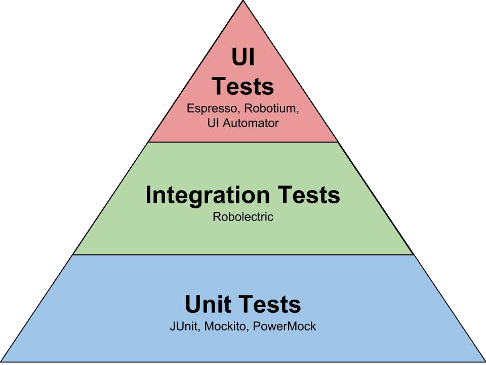

# Android Interview

## Tests Questions

1. #### What is test pyramid?

   

Unit tests, integration tests, and UI tests are all types of software testing, but they serve different purposes and operate at different levels of the application:

  - **Unit Tests**: These are the most granular tests and focus on testing individual components or functions of the code in isolation. They ensure that each part of the system performs as designed. Unit tests are typically written and run by developers and are used to test the functionality of specific sections of code, often using mock objects to simulate interactions with other parts of the system
  - **Integration Tests**: These tests check the interactions between different parts of the application, such as modules or services, to ensure they work together as expected. Integration tests are more complex than unit tests because they involve multiple components and their interactions. They can be used to detect issues in the interfaces and interaction between integrated units.
  - **UI Tests**: Also known as User Interface tests, these are designed to ensure that the application’s interface works as expected with user interactions. UI tests simulate user behavior and are often automated to perform tasks such as clicking buttons, entering text, and navigating through the application. They are crucial for verifying the end-to-end functionality of the application from the user’s perspective.

2. #### Are you familiar with Unit testing?

3. #### Explain unit test? What does Unit Testing suppose to do?

   * Unit testing involves breaking your program into pieces and subjecting each piece to a series of tests.
   * These tests can run on a Continues Integration (CI) (namely GitHub actions, Circle Ci, or Travis Ci) and keep the code quality

4. #### How to write testable code? What things make code hard to test?

   * Hard dependencies, static methods.

5. #### Explain instrumented test?

6. #### What is Espresso?

7. #### What is Robolectric?

8. #### Why we use Mockito/MockK?
